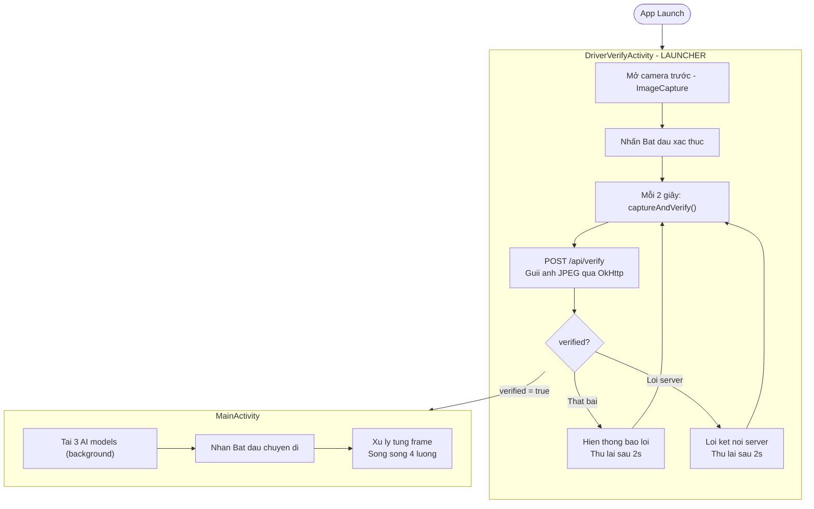
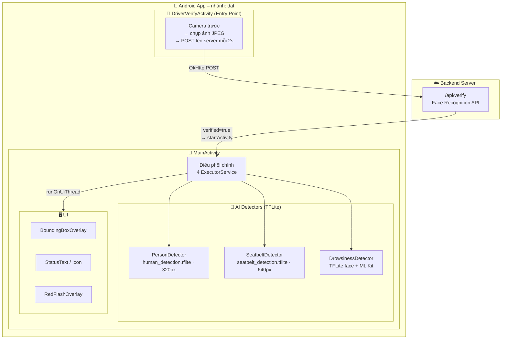
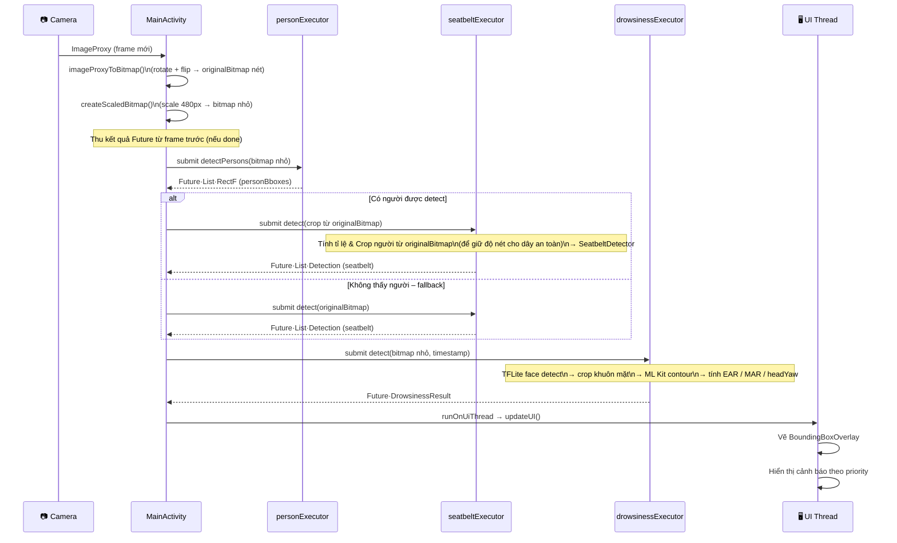
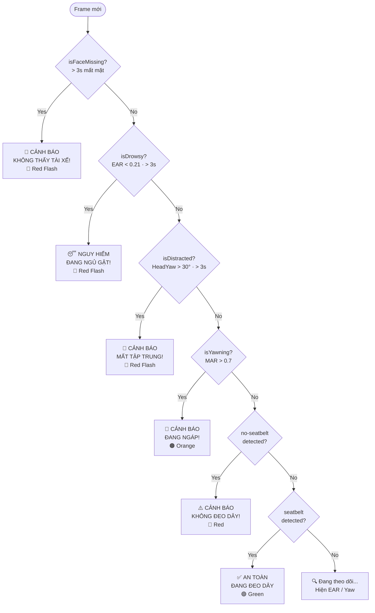
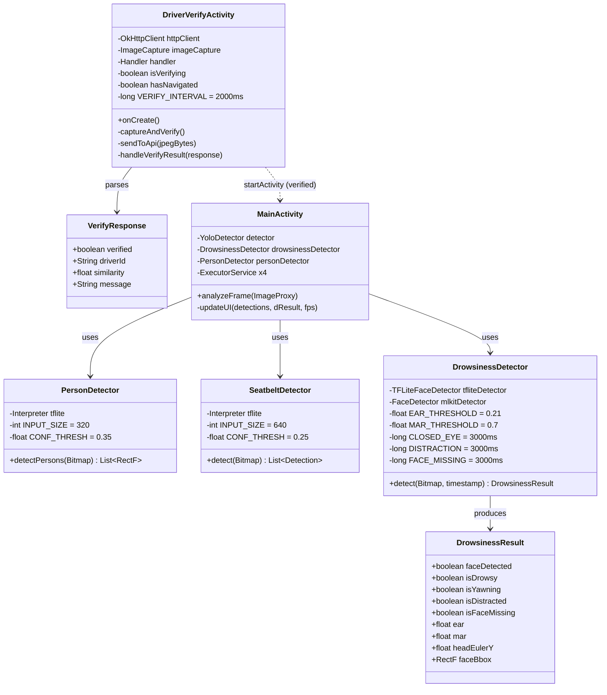

# AppDetect – System Diagram
> **Nhánh hiện tại:** `dat` · **Commit mới nhất:** `ed506b1` – _"sua lai model person detect va seatbelt detect"_

---

## 1. Luồng khởi động app (App Startup Flow)

---

## 2. Kiến trúc tổng quan (Component Diagram)

---

## 3. Luồng xử lý mỗi frame (Sequence Diagram)

---

## 4. Logic cảnh báo (Priority Decision Flow)

---

## 5. Class Diagram

