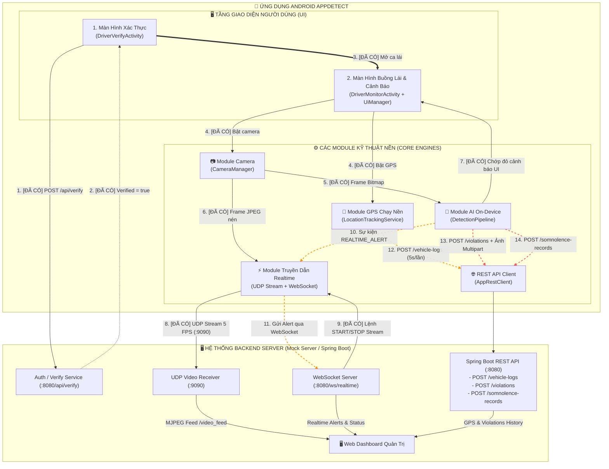

# Bức Tranh Toàn Cảnh & Luồng Hệ Thống (System Flow)

Tài liệu này mô tả chi tiết **kiến trúc phân tầng**, **trạng thái triển khai** của từng luồng kết nối, **đặc tả giao thức truyền thông (REST API, WebSocket, UDP Stream)** và **hướng dẫn tích hợp cho Backend Spring Boot**.

---

## 1. Sơ Đồ Kiến Trúc & Trạng Thái Luồng Kết Nối

> 🟢 **Nét liền (Xanh lá)**: Luồng đã hoàn thiện trong codebase  
> 🟠 **Nét đứt (Cam / Đỏ)**: Luồng tích hợp API & Alert thời gian thực



---

## 2. Đặc Tả Chi Tiết Giao Thức & API Cho Spring Boot

Dưới đây là đặc tả kỹ thuật chi tiết giúp đội ngũ Backend Spring Boot dễ dàng triển khai Controller, DTO và WebSocket Handler.

### 2.1. REST API: Xác Thực Tài Xế (`POST /api/verify`)
- **Mục đích**: Nhận ảnh chụp khuôn mặt từ màn hình quét mặt của tài xế, so khớp vector đặc trưng và trả về kết quả cho phép mở ca lái.
- **Content-Type**: `multipart/form-data`
- **Request Body**:
  - `image`: File ảnh chụp khuôn mặt (JPEG/PNG).
- **Response mẫu (`200 OK`)**:
  ```json
  {
    "verified": true,
    "driver_id": "1",
    "similarity": 0.965,
    "message": "Xác thực tài xế thành công"
  }
  ```

---

### 2.2. REST API: Nhật Ký GPS Định Kỳ (`POST /vehicle-logs`)
- **Mục đích**: Gửi tọa độ GPS, tốc độ xe đều đặn mỗi 5 giây từ `LocationTrackingService` chạy nền.
- **Content-Type**: `application/json`
- **Request Body DTO**:
  ```json
  {
    "driverId": 1,
    "vehicleId": "1",
    "latitude": 21.028511,
    "longitude": 105.854167,
    "speed": 12.5,
    "timestamp": 1740272400000
  }
  ```
  *(Lưu ý: `speed` tính bằng m/s hoặc km/h).*
- **Response mẫu (`200 OK`)**:
  ```json
  {
    "status": "SUCCESS",
    "message": "Log received",
    "timestamp": 1740272400000
  }
  ```

---

### 2.3. REST API: Ghi Nhận Vi Phạm & Ảnh Bằng Chứng (`POST /violations`)
- **Mục đích**: Khi phát hiện tài xế không cài dây an toàn (`NO_SEATBELT`), ngủ gật (`DROWSY`), mất tập trung (`DISTRACTED`), App sẽ gửi dữ liệu vi phạm kèm frame ảnh chụp hiện tại trong **1 request Multipart duy nhất** để tối ưu 50% băng thông 4G.
- **Content-Type**: `multipart/form-data`
- **Form Fields**:
  - `driverId` (Long/Integer): ID tài xế (VD: `1`).
  - `violationType` (String): `NO_SEATBELT` | `DROWSY` | `DISTRACTED` | `PHONE_USE`.
  - `latitude` (Double): Vĩ độ tại thời điểm vi phạm.
  - `longitude` (Double): Kinh độ tại thời điểm vi phạm.
  - `timestamp` (Long): Timestamp mili-giây.
  - `image` (Binary/File): File ảnh JPEG bằng chứng (~30KB).
- **Response mẫu (`200 OK`)**:
  ```json
  {
    "status": "SUCCESS",
    "violationId": 108,
    "message": "Recorded violation NO_SEATBELT",
    "imageUrl": "/static/evidence/evidence_1_1740272400_NO_SEATBELT.jpg"
  }
  ```

---

### 2.4. REST API: Nhật Ký Ngủ Gật (`POST /somnolence-records`)
- **Mục đích**: Lưu trữ chỉ số độ mở mắt (EAR), độ mở miệng (MAR) để phân tích thống kê sức khỏe tài xế.
- **Content-Type**: `application/json`
- **Request Body DTO**:
  ```json
  {
    "driverId": 1,
    "ear": 0.14,
    "mar": 0.82,
    "closedEyeDurationMs": 3200,
    "timestamp": 1740272400000
  }
  ```
- **Response mẫu (`200 OK`)**:
  ```json
  {
    "status": "SUCCESS",
    "message": "Somnolence record saved"
  }
  ```

---

### 2.5. Giao Thức WebSocket Realtime (`/ws/realtime`)
- **URL Handshake**: `ws://<SERVER_IP>:8080/ws/realtime?type=APP&driverId=1`
- **Chiều Server ➔ App (Điều khiển Stream Video)**:
  - Bắt đầu truyền video: Gửi chuỗi text `"START_STREAM"`.
  - Dừng truyền video: Gửi chuỗi text `"STOP_STREAM"`.
- **Chiều App ➔ Server (Bắn Cảnh Báo Tức Thời)**:
  ```json
  {
    "type": "REALTIME_ALERT",
    "driverId": 1,
    "alertType": "DROWSY",
    "message": "Cảnh báo buồn ngủ: Nhắm mắt vượt quá 3 giây!",
    "timestamp": 1740272400000
  }
  ```

---

### 2.6. Giao Thức Truyền Video UDP (Port `9090`)
- **Socket**: UDP Datagram Socket `0.0.0.0:9090`.
- **Tần số (Throttle)**: Tối đa 5 FPS (200ms / frame).
- **Cấu trúc Binary Packet**:
  ```
  ┌─────────────────────────────────┬─────────────────────────────────┐
  │ 8 Bytes (Big-Endian int64)      │ N Bytes (JPEG nhị phân)         │
  │ driverId                        │ Dữ liệu ảnh JPEG nén chất lượng 60% │
  └─────────────────────────────────┴─────────────────────────────────┘
  ```
  - Byte `0..7`: `driverId` (dạng `long` 64-bit Big-Endian).
  - Byte `8..N`: Toàn bộ mảng byte JPEG (`.jpg`).
  - Kích thước packet an toàn: `< 60,000 bytes`.

---

## 3. Lợi Ích Của Thiết Kế Hệ Thống Hiện Tại
1. **Tiết Kiệm Băng Thông Tối Đa**: Gộp ảnh vi phạm thành Multipart 1 round-trip. Video chỉ truyền khi Server gửi lệnh `START_STREAM` với tốc độ tối ưu 5 FPS.
2. **Độ Trễ Thấp**: Cảnh báo vi phạm được bắn qua WebSocket với độ trễ `< 50ms`.
3. **Phân Tách Trách Nhiệm Rõ Ràng (SRP)**: App xử lý AI On-device, nén dữ liệu tại chỗ; Server tập trung điều phối realtime và lưu trữ bản ghi.
